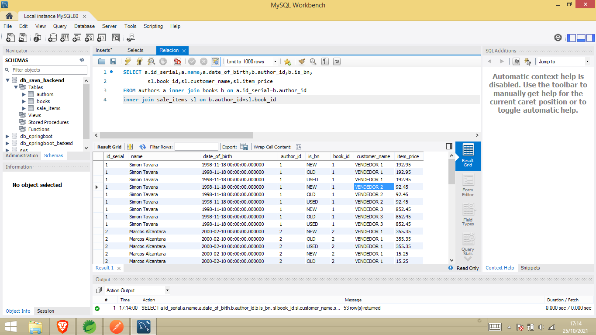
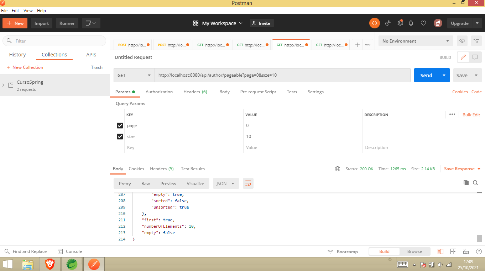

# Ravn-Challenge-Backend-Simon
Database genered with Spring Boot
Data in src\main\resources

import.sql

#Relation BD

SELECT a.id_serial,a.name,a.date_of_birth,b.author_id,b.is_bn,
		sl.book_id,sl.customer_name,sl.item_price
FROM authors a inner join books b on a.id_serial=b.author_id
inner join sale_items sl on b.author_id=sl.book_id

1) Who are the first 10 authors ordered by date_of_birth?
SELECT TOP 10 * FROM authors ORDER BY  date_of_birth DESC

2) What is the sales total for the author named “Lorelai Gilmore”?

select a.name , b.author_id , SUM(sl.item_price) from authors a inner join books b on a.id_serial=b.author_id
inner join sale_items sl on b.id_serial=sl.book_id where a.name='Lorelai Gilmore'

3) What are the top 10 performing authors, ranked by sales revenue?

select a.name , b.author_id, sl.item_price  from authors a inner join books b on a.id_serial=b.author_id
inner join sale_items sl on b.id_serial=sl.book_id order by sl.item_price DESC

#API

